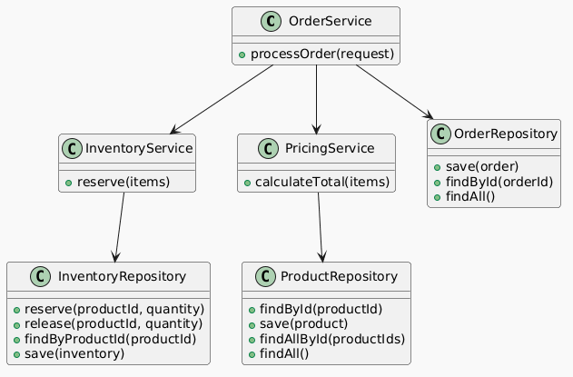

# Order Processing Service

<!-- TOC -->
  * [Overview](#overview)
  * [Main Features](#main-features)
  * [Architecture Overview](#architecture-overview)
  * [Key Design Decisions](#key-design-decisions)
  * [Testing Strategy](#testing-strategy)
  * [Future Improvements](#future-improvements)
  * [Running the Project](#running-the-project)
<!-- TOC -->

## Overview

This project is a simplified version of a backend-oriented order processing service designed specifically to demonstrate software engineering principles such as:

- Service orchestration
- Concurrency handling
- Inventory reservation
- Compensation/rollback logic
- Domain-oriented exception handling
- Clean architecture and code organization

In-memory repositories are used intentionally in the implementation to keep the focus on business logic, architecture decisions and code quality instead of infrastructure concerns.

---

## Main Features

- Order processing workflow
- Inventory reservation and release
- Pricing calculation
- Thread-safe inventory updates
- Rollback mechanism for failed reservations
- Domain-oriented exception handling
- Unit tests for orchestration, rollback and concurrency scenarios

---

## Architecture Overview

The application has a simple structure around a service-oriented architecture where:

- `OrderService` orchestrates the order workflow
- `PricingService` handles pricing calculation
- `InventoryService` manages inventory reservations and rollback logic
- Repository classes abstract data access responsibilities

### Architecture Diagram



---

## Key Design Decisions

### In-Memory Repositories

Instead of using a database, each repository uses an in-memory data structures to keep the project focused on orchestration and business logic, and lightweight.

### Thread-Safe Inventory Reservation

To prevent race conditions and allow atomic inventory updates during concurrent reservations `ConcurrentHashMap.compute()` is used as in-memory data store.

### Compensation-Based Rollback

Instead of relying on database transactions managed by Spring Data, when part of the order processing fails, the application uses compensation logic to rollback successful reservations.

### Immutable Models

Java `record` types are used where appropriate to reduce side effects, and, improve immutability and predictability.

### BigDecimal for Monetary Values

`BigDecimal` is used for price calculations to avoid floating-point precision issues.

---

## Testing Strategy

Instead of exhaustive coverage, the tests focus on high-value business scenarios.

Main scenarios covered include:

- Successful order processing
- Inventory rollback on failure
- Concurrent reservation handling
- Pricing calculation
- Failure handling and exception propagation

---

## Future Improvements

Possible production-oriented improvements include:

- Replace in-memory repositories with persistent storage
- Add transactional boundaries
- Introduce optimistic/distributed locking strategies
- Add REST API layer
- Introduce asynchronous/event-driven processing
- Add observability (logging, metrics, tracing)

---

## Running the Project

### Run Tests

```bash
./mvnw test
```

### Java Version

- Java 21